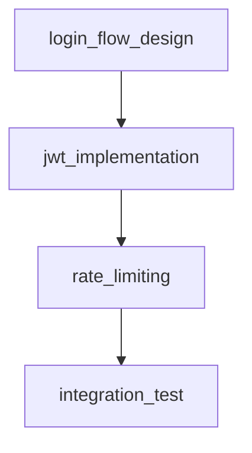

# META-v6 Sub-Workflow Specifications

> **Purpose:** Define I/O contracts, hook configs, and evaluation criteria for SW1-SW5

## SW1: Task Analysis

**Input:** `tasks.md` (natural language task descriptions)
**Output:** `outputs.md` (output specifications)
**Workflow:** `docs/benchmarks/workflows/sw1-task-analysis.yml`
**Script:** `scripts/meta-v6/run-sw1.sh`

### Input Contract

**tasks.md Format:**
```markdown
# Project Tasks

## Task: [Task Name]
**Description:** [Detailed description]
**Priority:** [high/medium/low]
**Dependencies:** [Task names]
**Acceptance Criteria:**
- [Criteria 1]
- [Criteria 2]

## Subtasks
- [Subtask 1]
- [Subtask 2]
```

**Required Fields:**
- Task name (markdown heading)
- Description (paragraph or list)
- Priority (optional, defaults to medium)

**Optional Fields:**
- Dependencies (list of task names)
- Acceptance criteria (list)
- Subtasks (nested list)

### Output Contract

**outputs.md Format:**
```markdown
# Output Specifications

## Step: [Step Name]
**Source Task:** [Task name from tasks.md]
**Output File:** [File path]
**Output Format:** [markdown/json/yaml/code]
**Validation Criteria:**
- [Criteria 1]
- [Criteria 2]

## Output Mapping
| Step Name | Output File | Format | Validation |
|-----------|-------------|--------|------------|
| login_flow_design | docs/design/login_flow.md | markdown | Has diagram |
| jwt_implementation | src/auth/jwt.rs | code | Compiles |
```

**Required Fields:**
- Step name (must match task name or be derived)
- Source task (reference to tasks.md)
- Output file path
- Output format
- At least one validation criterion

**Quality Gates:**
- G1: Every task in tasks.md has a corresponding step
- G2: Output file paths are valid (no invalid characters)
- G3: Output formats are recognized (markdown/json/yaml/code)
- G4: Validation criteria are testable (not vague)

### Hook Configuration

**Triggers to Wire:**
1. `before_workflow` - Log workflow start
2. `before_step_starts` - Log step being processed
3. `after_step_succeeds` - Save step output to markdown
4. `after_workflow` - Log workflow completion

**Example Hook Config:**
```yaml
hooks:
  before_workflow:
    - log:
        message: "SW1: Task Analysis started"
        to_file_path: "logs/sw1-start.log"

  before_step_starts:
    - log:
        message: "Processing task: {{step_name}}"
        to_file_path: "logs/sw1-steps.log"

  after_step_succeeds:
    - save_to:
        file_path: "docs/plans/meta-v6/outputs/sw1-{{step_name}}.md"
        content: |
          # Step: {{step_name}}
          Source: {{source_task}}
          Output: {{output_file}}
          Format: {{output_format}}
    - log:
        message: "Saved output spec for {{step_name}}"

  after_workflow:
    - log:
        message: "SW1: Task Analysis completed"
        to_file_path: "logs/sw1-complete.log"
```

### Evaluation Criteria

**E1: Input Coverage**
- Metric: `count(tasks.md tasks) == count(outputs.md steps)`
- Pass: 100% coverage
- Fail: <100% coverage

**E2: Output Path Validity**
- Metric: All output file paths parse correctly
- Pass: No parse errors
- Fail: Parse error detected

**E3: Format Recognition**
- Metric: All output formats in {markdown, json, yaml, code}
- Pass: 100% valid formats
- Fail: Unknown format detected

**E4: Validation Testability**
- Metric: All validation criteria are testable
- Pass: All criteria testable
- Fail: Vague criterion found

**E5: Hook Firing**
- Metric: All 4 triggers fire (check logs)
- Pass: 4/4 triggers present
- Fail: Missing trigger in logs

---

## SW2: Output Structure

**Input:** `outputs.md` (output specifications)
**Output:** `categories.md` (category design)
**Workflow:** `docs/benchmarks/workflows/sw2-output-structure.yml`
**Script:** `scripts/meta-v6/run-sw2.sh`

### Input Contract

**outputs.md Format:** As defined in SW1 output contract

**Required Data:**
- Step names
- Output file paths
- Output formats
- Validation criteria

### Output Contract

**categories.md Format:**
```markdown
# Category Design

## Category: [Category Name]
**Directory:** [Directory path]
**Description:** [What this category contains]
**File Types:** [List of file extensions]
**Naming Convention:** [Pattern for file names]

## Outputs in Category
| Step Name | Output File | Format | Category |
|-----------|-------------|--------|----------|
| jwt_handler | src/auth/jwt.rs | code | auth |
| login_middleware | src/middleware/login.rs | code | middleware |

## Directory Structure
```
src/
├── auth/
│   ├── jwt.rs
│   └── login_handler.rs
├── middleware/
│   ├── login.rs
│   └── rate_limiter.rs
└── main.rs
```
```

**Required Fields:**
- Category name
- Directory path
- At least one output per category
- Directory structure diagram

**Quality Gates:**
- G1: All outputs assigned to exactly one category
- G2: No empty categories (must have ≥1 output)
- G3: Directory structure is valid (no duplicate paths)
- G4: File types match actual outputs

### Hook Configuration

**Triggers to Wire:**
1. `before_workflow` - Log workflow start
2. `after_step_succeeds` - Append category to categories.md
3. `after_workflow` - Validate no empty categories

**Example Hook Config:**
```yaml
hooks:
  before_workflow:
    - log:
        message: "SW2: Output Structure started"

  after_step_succeeds:
    - append_to:
        file_path: "docs/plans/meta-v6/outputs/categories.md"
        content: |
          ## Category: {{category_name}}
          Directory: {{directory}}
          Outputs: {{output_count}}
    - log:
        message: "Added category {{category_name}}"

  after_workflow:
    - shell:
        command: "grep -c '## Category:' docs/plans/meta-v6/outputs/categories.md"
        bookmark_as: "category_count"
    - gwt:
        - given: "{{category_count}}"
          when: "> 0"
          then:
            - log:
                message: "✅ Categories defined: {{category_count}}"
          else:
            - fail:
                message: "❌ No categories defined"
```

### Evaluation Criteria

**E1: Output Assignment**
- Metric: Every output assigned to exactly one category
- Pass: 100% assignment, no duplicates
- Fail: Unassigned or duplicate outputs

**E2: Category Non-Empty**
- Metric: All categories have ≥1 output
- Pass: No empty categories
- Fail: Empty category found

**E3: Directory Validity**
- Metric: Directory paths parse correctly, no conflicts
- Pass: All paths valid
- Fail: Parse error or conflict

**E4: Structure Completeness**
- Metric: Directory structure matches actual outputs
- Pass: Structure complete
- Fail: Missing output in structure

---

## SW3: Category Mapping

**Input:** `categories.md` (category design)
**Output:** `structs.md` (struct definitions)
**Workflow:** `docs/benchmarks/workflows/sw3-category-mapping.yml`
**Script:** `scripts/meta-v6/run-sw3.sh`

### Input Contract

**categories.md Format:** As defined in SW2 output contract

**Required Data:**
- Category names
- Directory paths
- Output lists per category
- Directory structure

### Output Contract

**structs.md Format:**
```markdown
# Struct Definitions

## Step: [Step Name]
**Category:** [Category name]
**Directory:** [Directory path]
**Output File:** [File name]
**Depends On:** [List of step names]
**Model:** [Model name]
**Template:** [Prompt template with interpolation]
**Hooks:** [List of hooks with triggers]

## Step Dependencies


## Hook Strategy
- `before_step_starts`: Log step start
- `after_step_succeeds`: Save output, bookmark result
- `after_step_fails`: Log error, retry or fail
```

**Required Fields:**
- Step name
- Category (from categories.md)
- Directory (from categories.md)
- Depends on (list of step names)
- Model (must be "Qwen3-5-9B")
- Template (must use interpolation)

**Quality Gates:**
- G1: Every output from categories.md has a step definition
- G2: Dependencies form valid DAG (no cycles)
- G3: Model name is "Qwen3-5-9B" (fixed for META-v6)
- G4: Templates use at least one interpolation variable
- G5: At least 2 hooks per step (before and after)

### Hook Configuration

**Triggers to Wire:**
1. `before_workflow` - Log workflow start
2. `after_step_succeeds` - Save step definition
3. `after_workflow` - Validate DAG no cycles

**Example Hook Config:**
```yaml
hooks:
  before_workflow:
    - log:
        message: "SW3: Category Mapping started"

  after_step_succeeds:
    - save_to:
        file_path: "docs/plans/meta-v6/outputs/structs.md"
        content: |
          ## Step: {{step_name}}
          Category: {{category}}
          Model: {{model}}
          DependsOn: {{depends_on}}
    - bookmark:
        key: "step_{{step_name}}"
        value:
          step_name: "{{step_name}}"
          category: "{{category}}"

  after_workflow:
    - gwt:
        - given: "{{workflow_variables.total_steps}}"
          when: "> 0"
          then:
            - log:
                message: "✅ {{workflow_variables.total_steps}} steps defined"
          else:
            - fail:
                message: "❌ No steps defined"
```

### Evaluation Criteria

**E1: Step Coverage**
- Metric: Every output has a step definition
- Pass: 100% coverage
- Fail: Missing step definition

**E2: Dependency Validity**
- Metric: Dependencies form valid DAG
- Pass: No cycles detected
- Fail: Cycle detected

**E3: Model Consistency**
- Metric: All steps use "Qwen3-5-9B"
- Pass: 100% consistent
- Fail: Wrong model name

**E4: Template Interpolation**
- Metric: All templates use interpolation
- Pass: 100% use interpolation
- Fail: Missing interpolation

**E5: Hook Presence**
- Metric: ≥2 hooks per step
- Pass: ≥2 hooks per step
- Fail: Step with <2 hooks

---

## SW4: Struct Generation

**Input:** `structs.md` (struct definitions)
**Output:** `workflow.yml` (YAML skeleton)
**Workflow:** `docs/benchmarks/workflows/sw4-struct-generation.yml`
**Script:** `scripts/meta-v6/run-sw4.sh`

### Input Contract

**structs.md Format:** As defined in SW3 output contract

**Required Data:**
- Step names
- Categories
- Dependencies
- Models
- Templates
- Hooks

### Output Contract

**workflow.yml Skeleton Format:**
```yaml
version: 2.0.0

providers:
  llama_cpp_with_vulkan:
    config:
      host: localhost
      port: 8080

models:
  - name: Qwen3-5-9B
    host:
      type: llama_cpp_with_vulkan
      config:
        model_path: /models/Qwen3-5-9B-Q4_K_M.gguf
    parameters:
      n_ctx: 262144
      cache_type_k: q8_0
      cache_type_v: q8_0

steps:
  - name: login_flow_design
    model: Qwen3-5-9B
    prompt: "Design login flow for {{category}}"
    output:
      file_path: "docs/design/{{step_name}}.md"
    depends_on: []
    hooks:
      before_step_starts:
        - log:
            message: "Starting {{step_name}}"
      after_step_succeeds:
        - save_to:
            file_path: "{{output.file_path}}"
        - log:
            message: "Completed {{step_name}}"

workflow_hooks:
  before_workflow:
    - log:
        message: "Workflow started"
  after_workflow:
    - log:
        message: "Workflow completed"
```

**Required Fields:**
- `version: 2.0.0`
- `providers.llama_cpp_with_vulkan.config.host: localhost`
- `providers.llama_cpp_with_vulkan.config.port: 8080`
- `models[*].host.type: llama_cpp_with_vulkan`
- `steps[*].model: Qwen3-5-9B`
- `steps[*].hooks` (at least before and after)

**Quality Gates:**
- G1: Provider key = `llama_cpp_with_vulkan`
- G2: Host type = `llama_cpp_with_vulkan`
- G3: No non-schema keys
- G4: All steps have at least 2 hooks
- G5: Templates use interpolation

### Hook Configuration

**Triggers to Wire:**
1. `before_workflow` - Validate provider config
2. `after_step_succeeds` - Append step to YAML
3. `after_workflow` - Validate YAML skeleton

**Example Hook Config:**
```yaml
hooks:
  before_workflow:
    - log:
        message: "SW4: Struct Generation started"

  after_step_succeeds:
    - append_to:
        file_path: "docs/plans/meta-v6/outputs/workflow.yml"
        content: |
          - name: {{step_name}}
            model: {{model}}
            prompt: "{{template}}"
            hooks:
              before_step_starts:
                - log:
                    message: "Starting {{step_name}}"

  after_workflow:
    - shell:
        command: "grep -c 'providers:' docs/plans/meta-v6/outputs/workflow.yml"
        bookmark_as: "provider_count"
    - gwt:
        - given: "{{provider_count}}"
          when: "== 1"
          then:
            - log:
                message: "✅ Provider section present"
          else:
            - fail:
                message: "❌ Provider section missing or duplicate"
```

### Evaluation Criteria

**E1: Provider Key Correct**
- Metric: Provider key = `llama_cpp_with_vulkan`
- Pass: Key matches
- Fail: Wrong key

**E2: Host Type Correct**
- Metric: Host type = `llama_cpp_with_vulkan`
- Pass: Type matches
- Fail: Wrong type

**E3: Schema Validity**
- Metric: No non-schema keys
- Pass: All keys in schema
- Fail: Unknown key found

**E4: Hook Coverage**
- Metric: ≥2 hooks per step
- Pass: ≥2 hooks per step
- Fail: Step with <2 hooks

**E5: Template Presence**
- Metric: All prompts have interpolation
- Pass: 100% have interpolation
- Fail: Missing interpolation

---

## SW5: Workflow Assembly

**Input:** `workflow.yml` skeleton
**Output:** `workflow.yml` (validated)
**Workflow:** `docs/benchmarks/workflows/sw5-workflow-assembly.yml`
**Script:** `scripts/meta-v6/run-sw5.sh`

### Input Contract

**workflow.yml Skeleton Format:** As defined in SW4 output contract

**Required Data:**
- Provider section
- Models section
- Steps section
- Hook definitions

### Output Contract

**workflow.yml Validated Format:** Same as skeleton, plus:
- All required fields populated
- Schema validation passes
- Workflow-level hooks added
- Error handling hooks added

**Validation:**
- Schema valid (checked by runner)
- Provider key correct
- Host type correct
- No missing required fields
- No non-schema keys

**Quality Gates:**
- G1: Schema validation passes (`schema_valid=true` in logs)
- G2: No missing required fields
- G3: No non-schema keys
- G4: Workflow hooks present (before, after)
- G5: Error handling hooks present (after_step_fails, on_requires_failed)

### Hook Configuration

**Triggers to Wire:**
1. `before_workflow` - Validate schema
2. `after_step_succeeds` - No action (validation only)
3. `after_workflow` - Final validation and save

**Example Hook Config:**
```yaml
hooks:
  before_workflow:
    - log:
        message: "SW5: Workflow Assembly started"

  after_workflow:
    - shell:
        command: "grep 'schema_valid=true' docs/benchmarks/outputs/meta-workflow/*/run.log"
        bookmark_as: "schema_valid"
    - gwt:
        - given: "{{schema_valid}}"
          when: "!= ''"
          then:
            - log:
                message: "✅ Schema validation passed"
            - save_to:
                file_path: "docs/plans/meta-v6/outputs/final-workflow.yml"
                source_file_path: "docs/plans/meta-v6/outputs/workflow.yml"
          else:
            - fail:
                message: "❌ Schema validation failed"
```

### Evaluation Criteria

**E1: Schema Validity**
- Metric: `schema_valid=true` in logs
- Pass: Schema valid
- Fail: Schema invalid

**E2: Required Fields**
- Metric: All required fields present
- Pass: All present
- Fail: Missing field

**E3: Schema Compliance**
- Metric: No non-schema keys
- Pass: All keys in schema
- Fail: Unknown key

**E4: Workflow Hooks**
- Metric: before_workflow + after_workflow present
- Pass: Both present
- Fail: Missing hook

**E5: Error Handling**
- Metric: after_step_fails + on_requires_failed present
- Pass: Both present
- Fail: Missing hook

---

## Summary Table

| SW | Input | Output | Required Gates | Hook Count |
|----|-------|--------|----------------|------------|
| SW1 | tasks.md | outputs.md | G1-G4 (coverage, paths, formats, testability) | 4 triggers |
| SW2 | outputs.md | categories.md | G1-G4 (assignment, non-empty, validity, structure) | 3 triggers |
| SW3 | categories.md | structs.md | G1-G5 (coverage, DAG, model, template, hooks) | 3 triggers |
| SW4 | structs.md | workflow.yml | G1-G5 (provider, host, schema, hooks, template) | 3 triggers |
| SW5 | workflow.yml | workflow.yml (validated) | G1-G5 (schema, fields, compliance, workflow hooks, error) | 3 triggers |

---

**Document Status:** Draft
**Last Updated:** 2026-06-14
**Author:** META-v6 Planning Session
**Review Status:** Pending