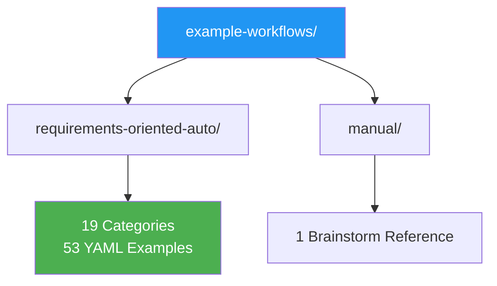

# Example Workflows

This directory contains all workflow examples for the AgentSDK schema, organized into two sections.



## Directory Structure

```
example-workflows/
├── requirements-oriented-auto/     53 examples across 19 categories
│   ├── 01-model-configuration/     Start here
│   ├── 02-step-types/
│   ├── ...
│   └── 19-comprehensive-integration/
├── manual/                         Human brainstorm reference
│   └── agentic-workflow-manual-brainstorm.yml
├── requirements-coverage-analysis.md   Schema coverage report
├── unified-schema-feature-verification.md   Feature verification
├── workflow-completion-summary.md    Project status
├── review-cycle-*.md               11 review cycles
└── missing-workflows-summary.md    Gap analysis
```

## Review Cycles

11 review cycles document schema quality, completeness, and comprehensibility:

| Cycle | Focus | Examples |
|-------|-------|---------|
| 1-5 | Schema completeness, coherence, models, control flow, permissions | Original 16 workflows |
| 6-8 | Completeness, consistency, schema quality | All workflows |
| 9 | Core schema comprehensibility for juniors | 52 individual examples |
| 10 | Advanced features (orchestration, guardrails) | Comprehensive integration |
| 11 | Edge cases and testing guidance | All examples |

## Schema Reference

- **Unified Schema**: `../unified-workflow-schema.yml`
- **Requirements Index**: `../index.md`
