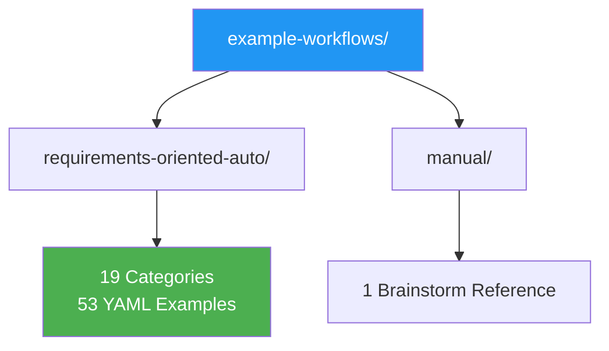

# Example Workflows

This directory contains all workflow examples for the AgentSDK schema, organized into two sections.



## Directory Structure

```
example-workflows/
├── requirements-oriented-auto/     53 examples across 19 categories
│   ├── 01-model-configuration/     Start here
│   ├── 02-step-types/
│   ├── ...
│   └── 19-comprehensive-integration/
├── manual/                         Human brainstorm reference
│   └── agentic-workflow-manual-brainstorm.yml
├── requirements-coverage-analysis.md   Schema coverage report
├── unified-schema-feature-verification.md   Feature verification
├── workflow-completion-summary.md    Project status
├── review-cycle-*.md               11 review cycles
└── missing-workflows-summary.md    Gap analysis
```

## Review Cycles

11 review cycles document schema quality, completeness, and comprehensibility:

| Cycle | Focus | Examples |
|-------|-------|---------|
| 1-5 | Schema completeness, coherence, models, control flow, permissions | Original 16 workflows |
| 6-8 | Completeness, consistency, schema quality | All workflows |
| 9 | Core schema comprehensibility for juniors | 52 individual examples |
| 10 | Advanced features (orchestration, guardrails) | Comprehensive integration |
| 11 | Edge cases and testing guidance | All examples |

## Schema Reference

- **Unified Schema**: `../unified-workflow-schema.yml`
- **Requirements Index**: `../index.md`

---

## Variable Interpolation Quick Reference

| Syntax | Purpose | Resolves | Example |
|--------|---------|----------|---------|
| `${models.xxx}` | Model definition reference | Parse time | `model: "${models.primary}"` |
| `${workflow.xxx}` | Workflow-level variable | Parse time | `path: "${workflow.output_dir}"` |
| `${workspace.xxx}` | Workspace path variable | Parse time | `path: "${workspace.codebase}"` |
| `{{step.step_id.output}}` | Step output capture | Runtime | `analysis: "{{step.step_1.output}}"` |
| `{{now}}` | Current timestamp | Runtime | `log: "Started at {{now}}"` |
| `{{workflow_id}}` | Workflow identifier | Runtime | `tag: "{{workflow_id}}"` |
| `{{run.number}}` | Execution run number | Runtime | `path: "run_{{run.number}}.log"` |

Rule: `${...}` for static structural references, `{{...}}` for runtime dynamic values.

---

## Configuration Comparison Tables

### Step Types

| Type | Use Case | Key Fields |
|------|----------|------------|
| agent | LLM inference | model, prompt, output |
| tool | Direct tool invocation | tool_name, parameters, timeout |
| code | Code execution | language, source, environment |
| hybrid | Mixed agent+tool | All of the above |

### Loop Types

| Type | Termination | Best For |
|------|-------------|----------|
| count | Fixed iterations | Batch processing, retries |
| foreach | Collection exhausted | Data pipelines, list processing |
| while | Condition becomes false | Polling, monitoring |
| validation | Score threshold met | Quality convergence, self-improvement |
| retry | Success or max attempts | Transient failure recovery |
| infinite | Manual stop / safety cap | Long-running monitoring |

### Execution Modes

| Mode | Behavior | Memory | Speed |
|------|----------|--------|-------|
| serial | One step at a time | Low | Slow |
| parallel | All steps simultaneously | High | Fast |
| hybrid | Mixed groups + sequential | Medium | Balanced |

### Validation Strategies

| Strategy | Matching | Strictness |
|----------|----------|------------|
| exact | Score >= threshold (e.g., 0.95) | Strictest |
| abstract | Semantic similarity | Flexible |
| tolerance | Score within range | Balanced |
| weighted | Multi-criteria composite | Configurable |

---

## Testing Guidance

### Validation Testing
1. **Schema validation**: Verify YAML structure matches unified schema
2. **Reference validation**: Ensure all `${...}` and `{{...}}` references resolve to defined targets
3. **Dependency validation**: Confirm step ordering and data flow dependencies are acyclic

### Functional Testing
1. **Single-step execution**: Test each step independently before wiring into pipelines
2. **Data flow verification**: Confirm step outputs pass correctly via `{{step.id.output}}` to downstream steps
3. **Loop convergence**: Run validation loops to verify termination conditions fire at expected thresholds
4. **Error scenarios**: Test retry (exponential/linear/fixed), escalation, and graceful recovery paths

### Integration Testing
1. **Sub-workflow composition**: Test parent-child parameter passing and output capture
2. **Parallel execution**: Verify concurrency limits, resource constraints, and timeout handling
3. **Checkpoint/resume**: Save state, interrupt workflow, and verify correct resume from checkpoint
4. **Guardrails**: Test content safety triggers, PII detection, and policy enforcement boundaries
