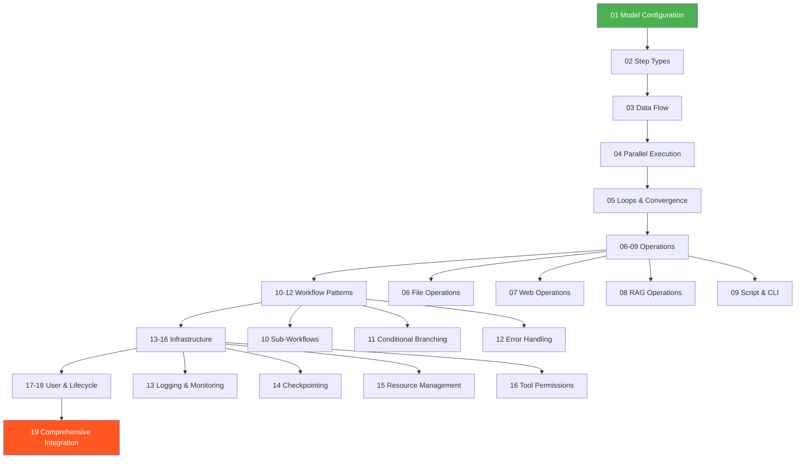

# Workflow Examples

53 YAML examples demonstrating the unified AgentSDK workflow schema across 19 categories.

## Quick Start

```bash
# Start here - simplest model configuration example
cat 01-model-configuration/01-basic-model-selection-providers.yaml
```

## Navigation Path



## Categories

| # | Category | Files | Focus |
|---|----------|-------|-------|
| 01 | [Model Configuration](01-model-configuration/) | 4 | Providers, parameters, lifecycle, cost tracking |
| 02 | [Step Types](02-step-types/) | 4 | LLM inference, code execution, tool invocation, hybrid |
| 03 | [Data Flow](03-data-flow/) | 3 | Variables, step outputs, context injection |
| 04 | [Parallel Execution](04-parallel-execution/) | 3 | Groups, concurrency, load balancing |
| 05 | [Loops & Convergence](05-loops-convergence/) | 4 | For/foreach/while, convergence reduction |
| 06 | [File Operations](06-file-operations/) | 2 | Read/write/batch, permissions |
| 07 | [Web Operations](07-web-operations/) | 3 | Fetch/scrape, REST APIs, URL parameters |
| 08 | [RAG Operations](08-rag-operations/) | 2 | Document indexing, context-aware generation |
| 09 | [Script & CLI](09-script-cli/) | 2 | Script execution, environment variables |
| 10 | [Sub-Workflows](10-sub-workflows/) | 2 | Nested references, composition patterns |
| 11 | [Conditional Branching](11-conditional-branching/) | 2 | Event-based branching, decision logic |
| 12 | [Error Handling](12-error-handling-retries/) | 3 | Retry/backoff, error propagation, graceful failure |
| 13 | [Logging & Monitoring](13-logging-monitoring/) | 3 | Hierarchical logging, metrics, structured output |
| 14 | [Checkpointing](14-checkpointing-state/) | 2 | Save/restore, state management |
| 15 | [Resource Management](15-resource-management/) | 3 | Memory allocation, CPU/GPU scheduling, limits |
| 16 | [Tool Permissions](16-tool-permissions/) | 2 | Allow/deny lists, step-level control |
| 17 | [User Inputs & UI](17-user-inputs-ui/) | 2 | Input validation, interactive feedback |
| 18 | [Hooks & Lifecycle](18-hooks-lifecycle/) | 4 | Pre/post hooks, error hooks, lifecycle events |
| 19 | [Comprehensive Integration](19-comprehensive-integration/) | 2 | Orchestration, guardrails, validation aggregation |

## Schema Reference

- **Unified Schema**: `../../unified-workflow-schema.yml`
- **Coverage Analysis**: `../requirements-coverage-analysis.md`
- **Manual Brainstorm**: `../manual/agentic-workflow-manual-brainstorm.yml`
